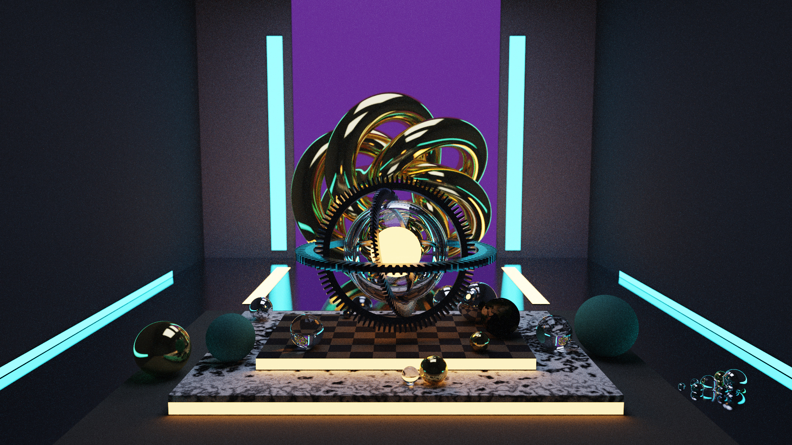
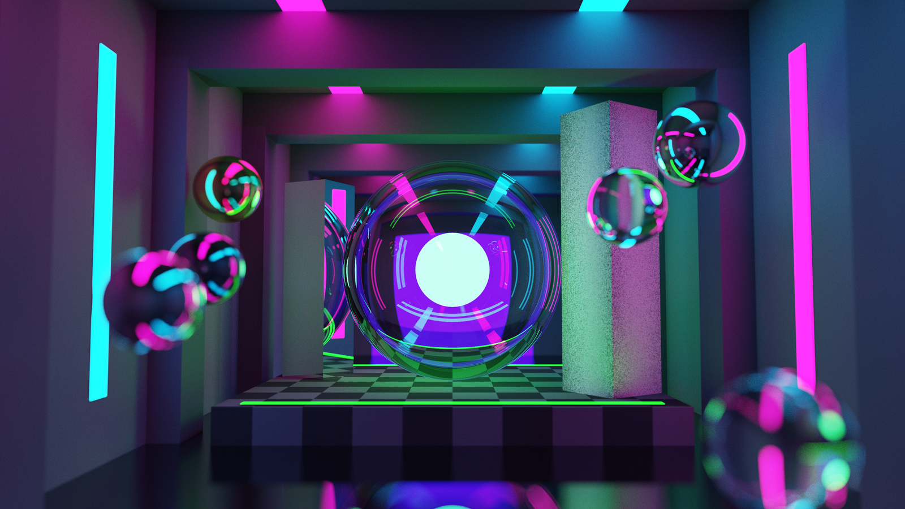
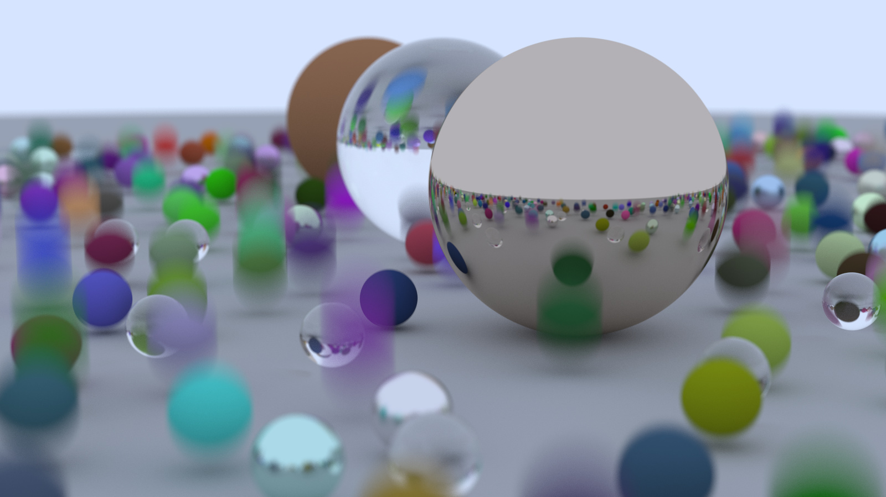
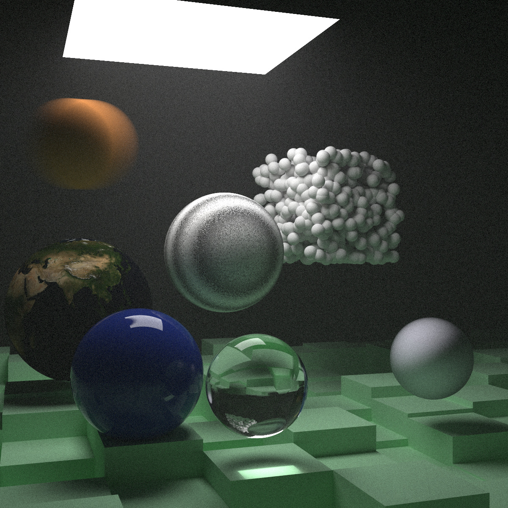
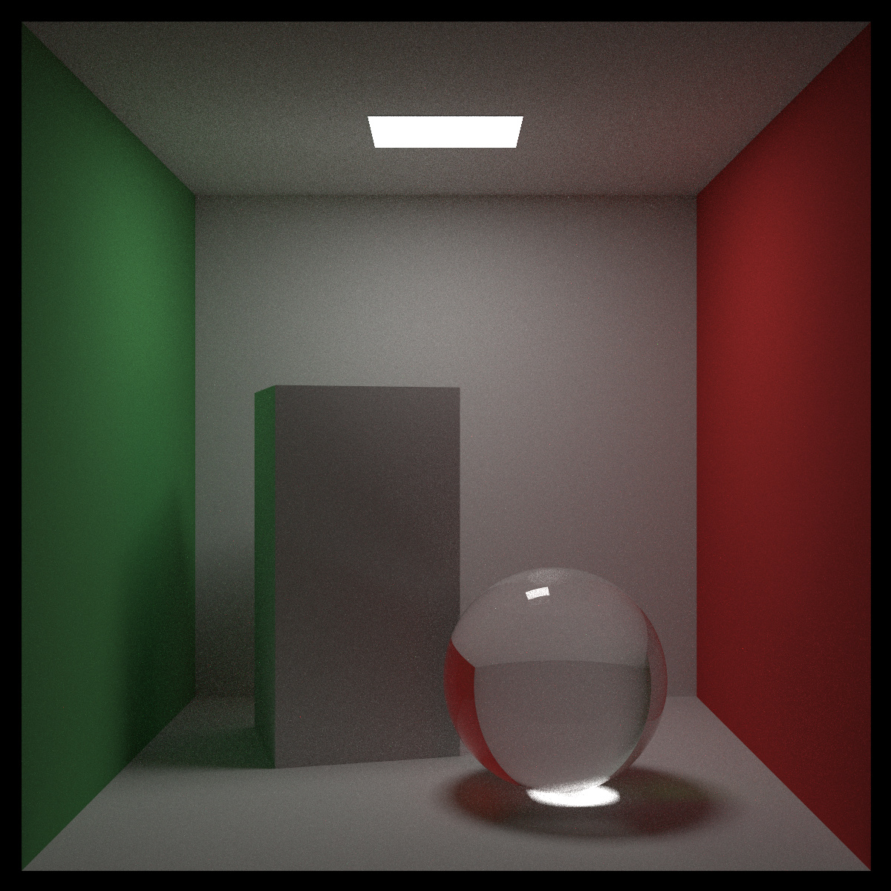

# Path Tracer

A physically-based path tracer written from scratch in modern C++, with a Rust
tool that validates its scene files and guards its output against regressions.

[](https://github.com/Reuzola/modern-cpp-cuda-path-tracer-with-rust-harness/actions/workflows/ci.yml)




A scene is described in a JSON file: geometry, materials, textures, lights and
a camera. The renderer traces millions of rays through it, follows each one as
it scatters, and integrates the result into an image. You can save that image
to a file or watch it sharpen in real time inside a window you can fly through.

The interesting part is not the picture. It is the machinery that produces it
correctly and repeatably: a SAH-built BVH over a flat node array, importance
sampling that stays unbiased, a sampler whose state comes from the pixel index
rather than a clock, and a reference set that holds the renderer to a
byte-identical result. When a render does drift, the difference is measured
rather than merely flagged, and an amplified difference image is written, so a
single changed pixel has nowhere to hide.

## Gallery

|  |  |
|---|---|
|  |  |
|  |  |

Every image is a render of a scene file in `scenes/`, produced by the `release`
build with no post-processing beyond the tone mapping the scene itself
specifies. The lossless originals are not tracked; what is committed here is
JPEG, for the repository's sake.

## The viewer

The same engine, driving a window instead of a file. The image accumulates one
sample pass at a time and keeps refining until it reaches the target; moving the
camera or changing the path depth restarts it, while exposure and tone mapping
are re-applied to the film already in memory. An overlay reports accumulated
samples, frame time and camera position, so a shot worth keeping is easy to
spot. One key then writes it out, a screenshot of what the window shows or an
EXR of the linear film behind it, and the camera position on the overlay is
what gets copied back into the scene file to keep the shot.

<!--  -->

*A recording of the viewer is not committed yet. It will land here.*

Controls and flags: [docs/usage.md](docs/usage.md).

## Features

**Geometry** — spheres, quads, boxes, triangles, indexed triangle meshes loaded
from OBJ, instancing under translate/rotate/scale transforms, and
constant-density volumes.

**Acceleration** — a bounding volume hierarchy built with a binned surface area
heuristic, stored as a flat depth-first array with multi-primitive leaves, and
traversed iteratively on an explicit stack, nearest child first.

**Materials and textures** — Lambertian, metal with roughness, dielectric with
Fresnel reflectance, emissive and isotropic; solid, checker, Perlin noise and
image textures.

**Light transport** — Monte Carlo path tracing with next event estimation
towards named importance targets, mixing a material's own density with the
light's through a mixture PDF.

**Camera and sampling** — configurable pose and field of view, defocus blur,
motion blur, and stratified samples on a per-pixel grid.

**Output** — PPM, PNG and OpenEXR. Tone mapping is a separate stage with an
exposure control and a choice of operators; EXR bypasses it and carries the
linear film.

**Scene format** — a documented JSON format with a JSON Schema that both the C++
loader and the Rust tool read as their single source of truth.

**Determinism** — the same scene, build and seed produce a byte-identical image.
Sampler state is derived from the pixel and sample index, never from wall-clock
time or thread identity, so the output does not depend on the order tiles are
visited in.

**The scene tool** — a Rust CLI that validates a scene file structurally and
semantically, and compares a render against a reference image by RMSE and PSNR,
writing an amplified difference image when they disagree.

**Quality gates** — a Catch2 suite run through CTest, a golden image regression
set, clang-tidy, AddressSanitizer and UndefinedBehaviorSanitizer, all wired into
CI along with a job that renders the reference set on every push.

## Quick start

Clang 18, CMake 3.25+, Ninja and vcpkg. Full prerequisites, presets and options
are in [docs/building.md](docs/building.md).

```bash
export VCPKG_ROOT=/path/to/vcpkg

cmake --preset release
cmake --build --preset release

./build/release/pathtracer scenes/cornell_box.json --output out/cornell.png
```

The viewer is opt-in, so a headless machine never has to resolve a windowing
stack:

```bash
cmake --preset release-viewer
cmake --build --preset release-viewer
./build/release-viewer/pathtracer_viewer scenes/cornell_box.json
```

The scene tool is a separate cargo workspace with no build-time coupling to the
CMake project:

```bash
cd tools/scene-tool
cargo build --locked --release
cd ../..
tools/scene-tool/target/release/scene-tool validate scenes/cornell_box.json
```

## Documentation

| | |
|---|---|
| [architecture.md](docs/architecture.md) | Layers, ownership, determinism, and what is deliberately absent |
| [building.md](docs/building.md) | Prerequisites, presets, options |
| [usage.md](docs/usage.md) | Command line, viewer controls, scripts |
| [scene-format.md](docs/scene-format.md) | The scene file, field by field |
| [testing.md](docs/testing.md) | Test suites and what each build configuration checks |
| [golden-images.md](docs/golden-images.md) | The reference image set and its thresholds |
| [benchmarks.md](docs/benchmarks.md) | Performance baseline, method, and what invalidates a comparison |
| [style-guide.md](docs/style-guide.md) | Naming and declaration conventions |
| [CONTRIBUTING.md](.github/CONTRIBUTING.md) | Branching and commit conventions |

## Roadmap

The renderer is single threaded today, and every figure in the benchmark
baseline is one core. That is the starting line for the next two pieces of work,
not an oversight:

**Performance** — multithreading, SIMD, cache-friendly memory layout, and
further traversal work measured against the recorded baseline.

**GPU** — a CUDA port, then hardware ray tracing through OptiX.

[architecture.md](docs/architecture.md) states plainly what the engine does not
do, so the shape of it is not overread.

## How AI was used

Stating this is more useful than leaving it to be guessed at.

The engine is written by hand. Every line of C++ under `include/` and `src/`,
and every line of Rust under `tools/scene-tool/src/` that is not a test, is
mine. No agent had write access to this repository, with one exception: scene
files under `scenes/` were authored with a coding agent against the schema.

A chat-based assistant, with no editor integration and no direct edits, was
used for four things:

- **Review.** Every non-trivial change was read back for bugs, dated idioms and
  unsound practice. A good share of the decisions recorded in this repository
  started as a correction.
- **Configuration and prose.** The CMake files, presets, the vcpkg manifest, the
  CI workflow, the JSON Schema, the dotfiles and the documents under `docs/`
  were drafted in conversation, then edited and cut down to what is here.
- **Tests.** The Catch2 cases and the Rust unit tests were drafted the same way,
  then read, corrected and extended.
- **Learning.** Modern C++ and Rust are both things this project taught me while
  it was being built, and asking was faster than guessing.

Everything arrived by hand: read, edited, and rejected when it was wrong. The
standard is a simple one: nothing is in this repository that I cannot explain,
including why it is there and what I chose not to do instead.

## Acknowledgements

Built by working through the *Ray Tracing in One Weekend* series by Peter
Shirley, Trevor David Black and Steve Hollasch, then taken well past it.

## License

MIT — see [LICENSE](LICENSE).

Third-party components and assets are listed in
[THIRD_PARTY_NOTICES.md](docs/THIRD_PARTY_NOTICES.md).
