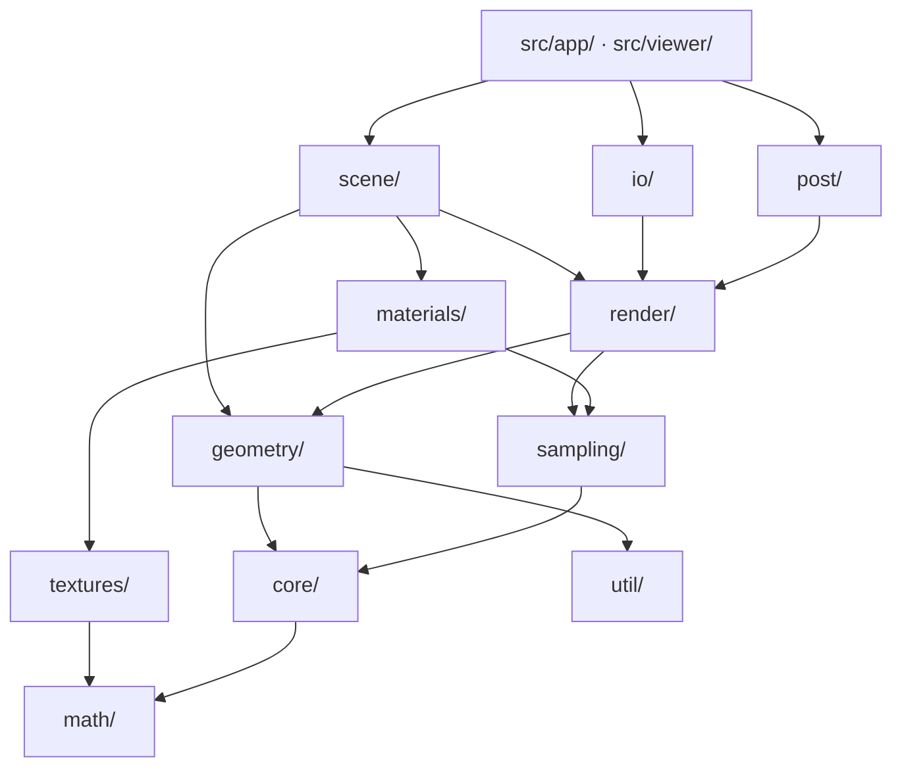
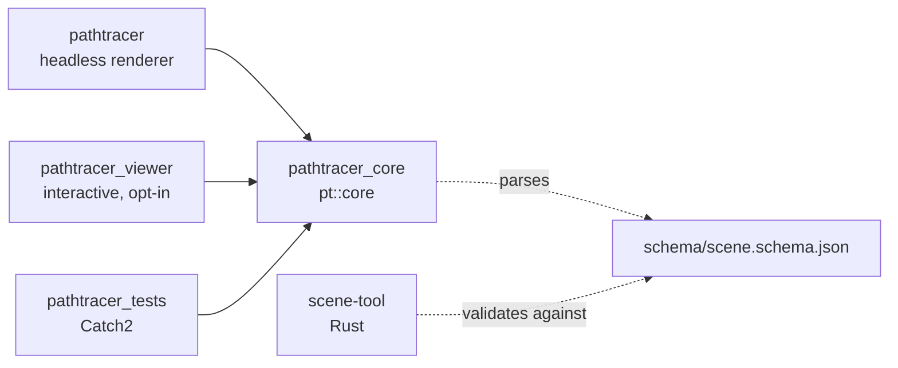

# Architecture

How the renderer is put together: what the layers are, which way dependencies
point, and what happens between reading a scene file and writing an image.

This describes the code as it stands rather than a plan for it. Where a
decision is not visible from the code, it is stated next to the thing it
constrains.

## Layers

The engine is a single static library, `pathtracer_core`, split into layers
under `include/pt/` and `src/`. The directory structure mirrors the layering,
and dependencies only point downwards.

- **`util/`** — logging with levels, an owning arena, and the traversal
  counters. Depends on nothing else in the project.
- **`math/`** — `Float` and the value types built on it: `Vec3`, `Color`,
  `Interval`, `Aabb`, `Ray`, `Onb`, `Transform`, plus `Sampler`, a PCG32
  generator. Depends only on the standard library.
- **`core/`** — the two interfaces the rest of the engine is written against.
  `Hittable` answers "does this ray hit you, and where"; `Sampleable` answers
  "give me a direction towards you, and the density of that choice".
  `HitRecord` is what an intersection produces.
- **`geometry/`** — `Sphere`, `Quad`, `Box`, `MeshTriangle` and the `Mesh`
  storage they index into; `Instance` for a transformed reference to another
  object; `ConstantMedium` for volumes; and `Bvh`.
- **`textures/`, `materials/`** — appearance. A `Texture` returns a colour for
  a surface point; a `Material` returns a `ScatterRecord` describing how a ray
  continues.
- **`sampling/`** — the densities used for importance sampling and the mixture
  that combines a material's own density with the explicitly sampled targets.
- **`render/`** — `Camera` (ray generation), `Film` (an HDR pixel buffer),
  `Integrator` and its one implementation `PathIntegrator`, `Renderer` (the
  loop), `Accumulator` (progressive sums), tiles and progress reporting.
- **`post/`, `io/`** — tone mapping and image writers. Both consume a `Film`,
  which is why they sit above `render/` rather than beside it.
- **`scene/`** — `Scene`, the aggregate everything above is handed, and the
  loaders that build it from a JSON file and from OBJ files.

## Targets

`pathtracer_core` holds everything; the executables above it are thin. The
driver is `main()` plus argument parsing. The viewer adds a window, a camera
controller and an overlay, and nothing in the engine knows it exists — a
one-way arrow, enforced by the viewer being a separate target that the engine
never links back to.

The Rust tool shares no code with the engine. The two meet at two file formats
instead: the JSON schema they both read, and the PNG and EXR images one writes
and the other compares. See [testing.md](testing.md) and
[golden-images.md](golden-images.md).

## From a scene file to an image

1. `load_scene` reads the document once, in order, and builds a `Scene`:
   textures, then materials, then objects, each resolved by name against what
   has already been built.
2. `Scene::build_bvh()` wraps the top-level object list in a tree. Meshes and
   groups get their own subtrees during loading.
3. `Renderer` divides the image into tiles and renders one full sample pass
   over every tile before starting the next. Progress is reported per pass.
4. For each sample, a fresh `Sampler` is constructed, the camera generates a
   ray through a stratified position inside the pixel, and `PathIntegrator`
   traces it.
5. Radiance is summed into a `Film` and divided by the sample count at the end.
6. LDR output passes through tone mapping; EXR is written from the linear film
   and skips that stage entirely.

`samples_per_pixel` is rounded down to a perfect square, because sample
positions are stratified on a `sqrt(spp) × sqrt(spp)` grid. Asking for 50
samples renders 49.

### Inside the integrator

`PathIntegrator::radiance` walks a path iteratively deepening through
`trace`, up to `max_depth` bounces. At each step it asks the world for the
closest hit, lets any participating medium along the segment interrupt that
hit with a scattering event, adds whatever the surface emits, and then asks the
material how to continue. A material either bounces specularly, with a single
determined direction, or diffusely, with a density to sample from. In the
diffuse case that density is mixed with one over the scene's importance
targets, which is what stops a small light from staying noisy.

A ray that hits nothing returns the scene's background radiance.

## Ownership

There is no reference counting anywhere in the scene graph. Instead:

- `Scene` owns everything, in arenas — one per kind of thing (`Texture`,
  `Material`, `Hittable`) plus a vector of meshes.
- Everything else refers to those objects through non-owning raw pointers.
  A pointer into a `Scene` is valid exactly as long as that `Scene` is.
- Member declaration order in `Scene` is load-bearing: members are destroyed
  in reverse, so the arenas that own objects are declared before the lists
  that only point at them.
- `Mesh` is neither copyable nor movable. Every `MeshTriangle` is a
  `(Mesh*, index)` pair, so relocating the mesh would dangle all of them.

The consequence to keep in mind when editing: `Scene` is movable but not
copyable, and moving one does not invalidate the pointers inside it, because
the arenas hold `unique_ptr`s and only the vectors move.

## Determinism

The same scene, build and seed produce a byte-identical image. Nothing in the
sampling path reads a clock, a thread id or a global generator.

Each sample constructs its own `Sampler` from
`sampler_seed(scene_seed, pixel_index, sample_index)`, a hash of the three.
The sampler is then passed down by parameter through the camera, the
integrator and the materials. Because the seed depends only on which pixel and
which sample, the order in which tiles are visited does not affect the result.

This is what makes the golden image comparison meaningful, and it is also the
reason the standard library's distributions are not used: the standard does
not specify their output, so a change of library would silently change every
image.

Two things do move the pixels, and both are build-level rather than run-level:
`-march=native` enables FMA contraction, and `Float = float` changes the
arithmetic throughout. Reference images are therefore only valid from the
`release` preset.

## Acceleration

`Bvh` is a flat array of nodes in depth-first order. The left child of an
interior node is always the next entry, so only the right child index is
stored; a node is a leaf when its primitive count is non-zero. The node is
size-checked by a `static_assert` so that a field added carelessly fails the
build rather than the cache.

Construction is a binned surface area heuristic sweep over the widest axis of
the centroid bounds, with a median split as a fallback for the cases the
heuristic cannot separate. Traversal is a loop over an explicit stack, visiting
the nearer child first and discarding a node once a closer hit is already in
hand.

Trees nest: a mesh's triangles get a tree, a `group` gets a tree, and the scene
gets a tree over those. Acceleration is never named in the scene file — it is
the renderer's decision, not the format's.

## Errors

Two different models, on purpose:

- **Loading throws.** `SceneError` carries a location that is assembled as the
  exception unwinds, so a failure deep inside a nested object reports the path
  that reached it rather than just the leaf. The happy path pays nothing.
- **Writing returns `bool`.** An `ImageWriter` failing to write is an ordinary
  outcome of an I/O call, and the call sites are few enough to check.

## What is not here

Stated plainly, so the shape of the thing is not overread:

- **The renderer is single threaded.** Tiles exist as a decomposition, but they
  are rendered one after another on one core.
- **No SIMD, and no GPU path.** All arithmetic is scalar `Float`.
- **No denoiser.** Noise is reduced by sampling more.
- **One integrator.** Unidirectional path tracing with next event estimation
  towards named targets. No bidirectional tracing, no photon mapping, no
  Metropolis sampling.
- **No Russian roulette.** Paths end at `max_depth`, which makes the sample
  cost predictable and the result slightly biased at low depths.
- **Five material types**, none of them layered, and no microfacet model.
- **RGB, not spectral.** Dispersion is not represented.
- **Transforms are translate, rotate and scale only** — no shear, no arbitrary
  matrix. Motion blur exists only for a sphere's centre.

## Further reading

| | |
|---|---|
| [building.md](building.md) | Prerequisites, presets and build options |
| [usage.md](usage.md) | Command line, viewer controls, scripts |
| [scene-format.md](scene-format.md) | The scene file, field by field |
| [style-guide.md](style-guide.md) | Naming and declaration conventions |
| [testing.md](testing.md) | Test suites and what each build checks |
| [golden-images.md](golden-images.md) | The reference image set |
| [benchmarks.md](benchmarks.md) | Performance baseline and method |
