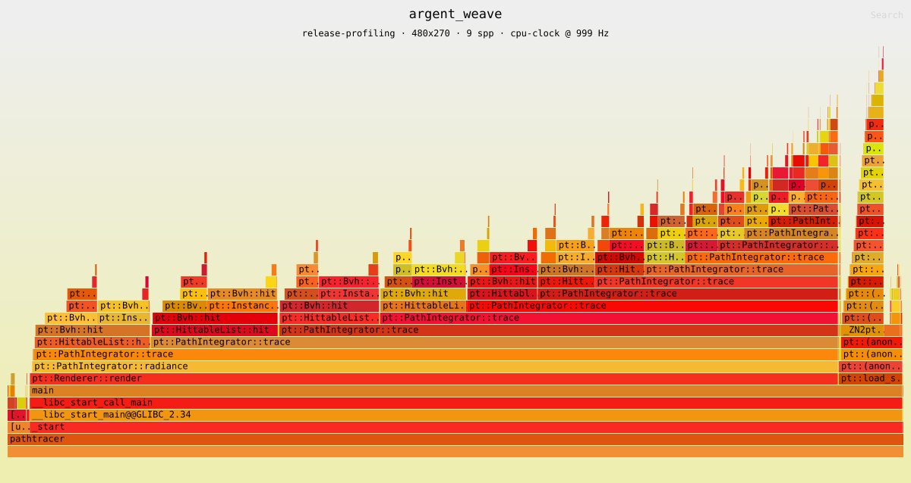

# Profiling

Where the renderer's time goes, how that was measured, and how to measure it
again. The recorded distribution below is what every later optimisation is
argued against: a change that does not move one of these numbers has not been
shown to do anything.

This is a sampling profile, not a timing measurement. Timings and the workload
they use are in [benchmarks.md](benchmarks.md); this document explains them
rather than adding to them.

## Prerequisites

`perf` and a flame graph renderer, neither of which the build needs — they are
developer tools, installed per machine.

### perf under WSL2

WSL2 runs a Microsoft kernel that Ubuntu has no matching `perf` package for, so
the wrapper in `linux-tools-common` cannot find a binary for `uname -r`:

```bash
sudo apt install -y linux-tools-common linux-tools-generic
ls /usr/lib/linux-tools/          # e.g. 6.8.0-138-generic
sudo ln -s /usr/lib/linux-tools/6.8.0-138-generic /usr/lib/linux-tools/$(uname -r)
```

The symlink points the wrapper at Ubuntu's 6.8 binary while the kernel is 6.6.
The skew is real and is accepted deliberately: it affects kernel-side features,
not the user-space sampling this document relies on. Building `perf` from the
WSL2 kernel source removes the skew and is the fallback if a `perf` subcommand
ever misbehaves.

`kernel.perf_event_paranoid` is left at its default of 2. That level permits
profiling one's own user-space processes and forbids resolving kernel symbols,
which is the right trade here: the workload is pure computation, and lowering a
system-wide security setting to label a few percent of frames is not worth it.
The consequence is visible in the output — kernel time appears as unresolved
addresses rather than named frames.

### The flame graph renderer

```bash
cargo install inferno --locked
```

`inferno` is a Rust port of the original FlameGraph scripts. It is preferred
here because it installs as a binary rather than a checked-out repository of
Perl scripts, and the toolchain to build it is already required by
`scene-tool`. Install it from outside `tools/scene-tool`, or its
`rust-toolchain.toml` pin will be applied to a tool that has nothing to do with
that crate.

Recorded with: `perf` 6.8.12, `inferno` 0.12.8.

### What is sampled

The event is `cpu-clock`, a software timer, at 999 Hz. The frequency is not a
round 1000 so that sampling cannot phase-lock with kernel timers and resample
the same point in a periodic loop.

Hardware counters are available on this host — `cycles`, `instructions` and
`cache-misses` all return figures under WSL2 — but they are not what these
profiles use. The question here is where wall time goes. Counting cycles
answers a different question and belongs with the work that asks it.

## The build

Profiles are taken from `release-profiling`, never from `release` or
`release-stats`.

`release-profiling` inherits `release` — same `-O3`, same ThinLTO, same scalar
type — and adds two flags:

- `-g` emits DWARF without changing code generation. It is what makes inlined
  code visible: most of the hot path lives in headers, and without debug
  information `Aabb::intersect` and the `Vec3` operators disappear into
  whichever function inlined them.
- `-fno-omit-frame-pointer` keeps the frame pointer so stacks can be unwound
  cheaply. This one does change code generation.

Profiling `release` directly does not work. Its stacks terminate at the first
frame — `Bvh::hit` followed by address zero — because the frame pointer is gone,
and a flame graph cannot be built from stacks of depth one.

`RelWithDebInfo` is not used either, and the preset that offered it was removed.
It builds at `-O2` without LTO, so its inlining decisions differ from the build
whose timings are on record. A profile of a different binary is not an
explanation of these numbers.

### What the extra flags cost

Measured on three scenes at their benchmark settings, three runs each, minimum
reported:

| Scene | `release` | `release-profiling` | Change |
|---|---|---|---|
| `gilded_orrery` | 9.298 s | 9.074 s | −2.4% |
| `cornell_smoke` | 12.058 s | 12.350 s | +2.4% |
| `earth` | 7.928 s | 8.123 s | +2.5% |

One scene came out faster, which a frame pointer cannot cause; the spread across
`gilded_orrery`'s own three runs was 5.8%, wider than the effect being looked
for. The honest reading is that the cost was not resolved and is smaller than
this machine can see. It is recorded rather than resolved because the number
feeds no decision: `release-profiling` is not a timing build, and no figure from
it appears in [benchmarks.md](benchmarks.md).

## Taking a profile

```bash
cmake --preset release-profiling
cmake --build --preset release-profiling
scripts/profile.sh
```

The workload is `benchmarks/manifest.txt`, unchanged. A profile taken at a
different resolution or sample count cannot explain a timing taken at these
ones. A single scene, or several:

```bash
scripts/profile.sh gilded_orrery cornell_smoke
```

Four files land in `out/profiles/` per scene:

| | |
|---|---|
| `<scene>.data` | The raw `perf` record. Kept so a profile can be re-examined without re-running it. |
| `<scene>.folded` | Identical stacks folded into counts. Small, and the file a later comparison would diff. |
| `<scene>.svg`, `<scene>-reversed.svg` | Flame graphs, forward and leaf-merged. |
| `<scene>.txt` | Flat self-time ranking, entries above 0.5%. |

## Reading the output

**Start with the flat ranking.** `<scene>.txt` answers "which function do I open
first" in one screen. It is produced with `-g none`: the integrator recurses to
the scene's maximum depth, and without that flag the same call chain repeats
down the page and buries everything else.

**The forward flame graph shows how time was reached**, the reversed one shows
what it was spent on. Both come from the same folded file, so neither costs an
extra measurement. In a recursive tracer the reversed graph is usually the
readable one: a function reached at twelve recursion depths appears once instead
of as twelve thin stripes.

**Recursion can also be collapsed in the forward view**, which keeps the call
structure while merging repeated frames:

```bash
inferno-collapse-recursive out/profiles/gilded_orrery.folded \
    | inferno-flamegraph > out/profiles/gilded_orrery-collapsed.svg
```

**For anything inlined, go to source lines.** A function that only exists in a
header has no symbol of its own, and its cost is reported against whatever
inlined it:

```bash
perf report --input out/profiles/gilded_orrery.data --stdio \
    --no-children -g none --sort srcline --percent-limit 1
```

This is how the slab test below was separated from the rest of BVH traversal.
Line attribution under `-O3` is approximate — instructions are scheduled across
statement boundaries — so read a cluster of adjacent lines together rather than
trusting a single one.

## The recorded distribution

Taken 2026-08-31 on the reference machine described in
[benchmarks.md](benchmarks.md): i7-11700K, Clang 18.1.3, `Float = double`,
single threaded, one render per scene at manifest settings, roughly ten thousand
samples each.

`argent_weave` was added on 2026-09-01, same machine and same method. The
profile covers the whole process, so scene loading and tree construction sit
inside it. For every other scene that is noise; for this one it is not —
`BvhBuilder::build_recursive` is 3.5% of its profile and the OBJ parser
another 1.5%, against a timed record that keeps construction outside the
measurement entirely.

Heaviest three entries per scene, by self time:

| Scene | | | |
|---|---|---|---|
| `argent_weave` | `Bvh::hit` 73.8% | `MeshTriangle::hit` 6.8% | `intersect_triangle` 6.2% |
| `random_spheres` | `Bvh::hit` 65.4% | `Sphere::intersect` 9.8% | `acos` 3.4% |
| `neon_cathedral` | `Bvh::hit` 64.1% | `Quad::intersect` 13.2% | `Sphere::intersect` 3.2% |
| `mesh_showcase` | `Bvh::hit` 59.7% | `intersect_triangle` 8.7% | `MeshTriangle::hit` 4.3% |
| `gilded_orrery` | `Bvh::hit` 58.2% | `Quad::intersect` 17.5% | `HittableList::hit` 3.6% |
| `quads` | `Bvh::hit` 51.1% | `Lambertian::scatter` 10.2% | `cos` 7.6% |
| `cornell_box` | `Bvh::hit` 45.2% | `Quad::intersect` 10.0% | `Lambertian::scatter` 6.9% |
| `showcase` | `Bvh::hit` 41.4% | `Sphere::intersect` 16.3% | `atan2` 9.8% |
| `checkered_spheres` | `Bvh::hit` 30.9% | `Sphere::intersect` 15.6% | `Lambertian::scatter` 8.3% |
| `area_lights` | `Bvh::hit` 29.6% | `Perlin::noise` 21.2% | `Sphere::intersect` 9.2% |
| `earth` | `Bvh::hit` 29.1% | `Sphere::intersect` 16.6% | `Renderer::render` 9.8% |
| `cornell_smoke` | `Quad::intersect` 42.9% | `Bvh::hit` 23.0% | `HittableList::hit` 6.1% |
| `perlin_spheres` | `Perlin::noise` 24.8% | `Bvh::hit` 20.8% | `Sphere::intersect` 10.4% |



Six flame graphs are kept in `profiles/`, one per regime the set contains:
`argent_weave` (dense traversal, a single deep tree), `gilded_orrery`
(traversal, nested trees), `cornell_smoke` (volumetric), `perlin_spheres`
(texture evaluation), `showcase` (mixed), and a reversed view of
`gilded_orrery`.

### The slab test is the hottest code in the engine

Source lines inside `Bvh::hit` for `gilded_orrery`:

| Line | | Share |
|---|---|---|
| `aabb.hpp:73` | narrow `ray_t.max` | 16.7% |
| `aabb.hpp:62` | `t_near` from the reciprocal | 9.0% |
| `aabb.hpp:71` | swap on the sign of the reciprocal | 6.9% |
| `aabb.hpp:75` | empty-interval rejection | 5.1% |
| `aabb.hpp` | unattributed | 1.4% |

`Aabb::intersect` accounts for 39% of the scene's total time — around two thirds
of what `Bvh::hit` is credited with. Its neighbour `aabb.hpp:72`, which narrows
`ray_t.min` with the same shape of code, does not appear above the 0.5%
threshold at all. The asymmetry is unexplained and worth a look before that loop
is rewritten.

Source lines inside `Bvh::hit` for `argent_weave`:

| Line | | Share |
|---|---|---|
| `aabb.hpp:62` | `t_near` from the reciprocal | 20.5% |
| `aabb.hpp:73` | narrow `ray_t.max` | 17.1% |
| `aabb.hpp:71` | swap on the sign of the reciprocal | 8.0% |
| `aabb.hpp:75` | empty-interval rejection | 4.7% | 
| `aabb.hpp` | unattributed | 1.1% |

The slab test takes 51.4% of this scene, and the two heaviest lines have
swapped places against the scene above. Line attribution under `-O3` is
approximate enough that the swap is not worth explaining, but the total is
not: half of one render is four lines of one header.

`aabb.hpp:72` is again below the 0.5% threshold, on a different scene with a
different tree and a different ray distribution. Whatever hides it is a
property of the code rather than of one workload.

### Nested traversal is a quarter of the largest scene

`gilded_orrery` builds fifteen trees, and `Bvh::hit` calling itself accounts for
23.9% of the run: descending into a mesh leaf starts a fresh traversal of a
separate tree, with its own root test and its own stack.

### Two indirections show up on their own lines

Two lines outside the slab test are worth naming, both in `argent_weave`,
because both are dispatch rather than arithmetic.

`bvh.cpp:362` carries 5.1%. It is the `prim->hit()` call inside `hit_leaf`:
a virtual call through a `const Hittable*`, issued once per primitive the
traversal reaches. The leaves of this scene hold roughly one primitive each,
so that is one indirect call per leaf visited.

`mesh.hpp:82` carries 4.0%, one line of `Mesh::triangle`, which reads a
vertex position through the index buffer. A triangle is a `(Mesh*, index)`
handle, so fetching its three corners is two dependent loads per corner into
two separate arrays.

### The volumetric scene barely touches its tree

`cornell_smoke` spends 42.9% of its time in `Quad::intersect` while holding an
eleven-node tree. `ConstantMedium::sample_interaction` issues two unbounded
`hit` calls against its boundary per ray segment, the boundary is a box of six
quads behind a list, and the integrator tests every medium in the scene on every
segment regardless of where the ray goes.

### Transcendental functions are a visible fraction

`showcase` spends 9.8% in `atan2` and 7.7% in `acos`; `checkered_spheres` spends
roughly 24% across `acos`, `atan2`, `sin` and `cos`. The sources are
`get_sphere_uv`, which calls `atan2` and `acos` on every sphere hit, and cosine
sampling, which calls `sin` and `cos` on every diffuse bounce.

### Shading is not always the small half

`Perlin::noise` alone is 24.8% of `perlin_spheres` and 21.2% of `area_lights` —
more than traversal in both. `Renderer::render` carries 3-10% of self time
across the set, which is the inlined per-sample setup: constructing a `Sampler`,
generating the ray, and accumulating the result.

### One scene now carries the traversal case

`argent_weave` was authored for this. It puts `Bvh::hit` at 73.8% and the
slab test alone above half the run, on a single tree of 2.3M nodes — see
[benchmarks.md](benchmarks.md) for its counters.

The rest of the set has not changed shape. Three of the other twelve scenes
put `Bvh::hit` above half the run; in most of the remainder the tree is too
small to matter. What is new is that a traversal result no longer has to
rest on `random_spheres`, `neon_cathedral` and `gilded_orrery`, whose trees
are two to four orders of magnitude smaller than the one an optimisation
will be aimed at.

## What invalidates a profile

- A different build preset. `release-profiling` is the only one these numbers
  come from; `release` cannot be unwound and `release-stats` carries counters in
  the traversal loop.
- A changed row in `benchmarks/manifest.txt`, or a changed scene file. Both make
  the profile describe work that is no longer being timed.
- A different scalar type.
- A different machine. Only the reference machine is profiled.
- A busy machine. A sampling profile is a distribution, so interference shifts
  it rather than adding an obvious outlier the way a timing does.
- A re-framed camera on argent_weave. Its cost per ray query depends on
  how much of the frame the geometry covers, which is stated in
  [benchmarks.md](benchmarks.md).
